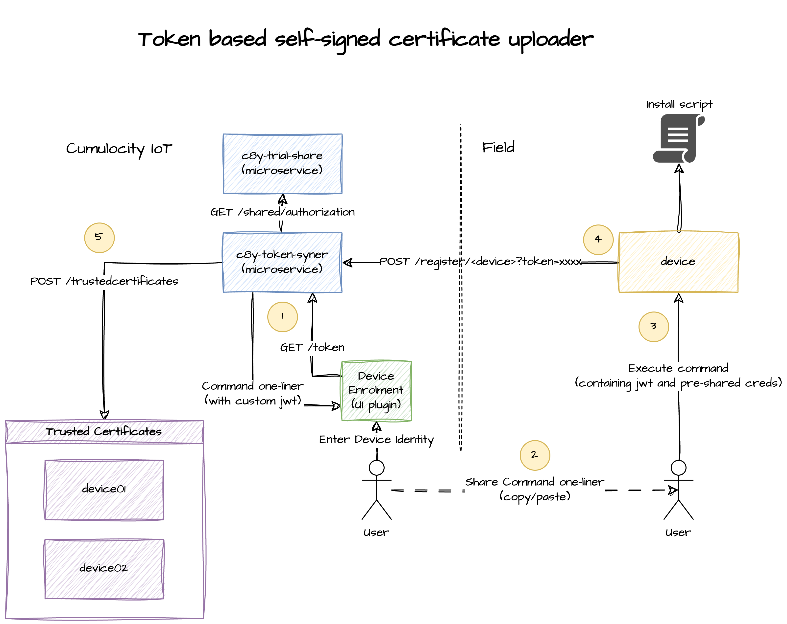
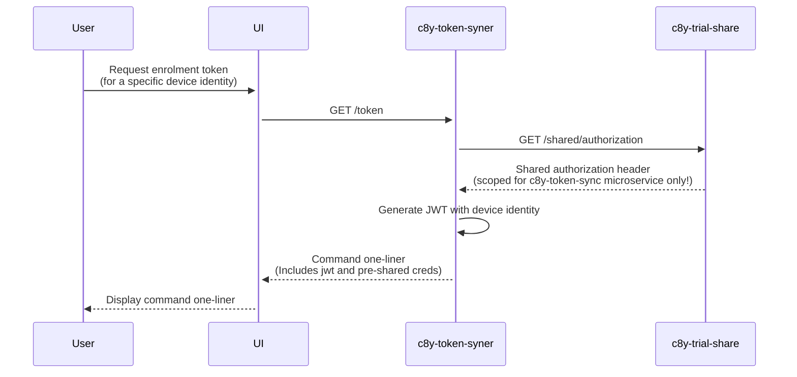
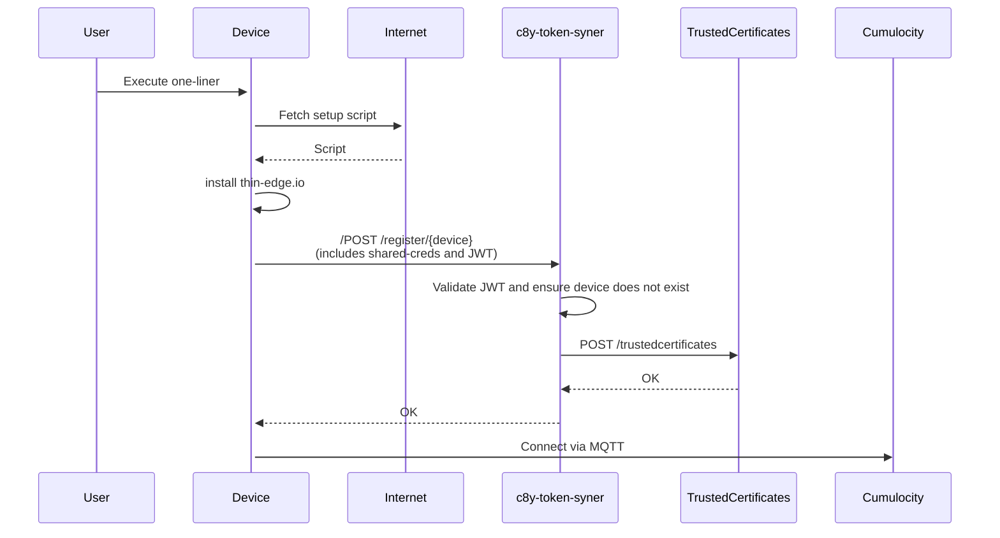

# Introduction

Experimental microservice to create one-time tokens to use to register devices for the first time.

:warning: Don't expect the docs or code to always work as it is only an experiment after all ;)

The project uses the unofficial github.com/reubenmiller/go-c8y Cumulocity client modules.



## Architecture

### Device Enrolment token generator



### Device enrolment



# Getting Started

## Starting the app locally

1. Clone the project

    ```sh
    git clone https://github.com/reubenmiller/c8y-token-syner.git
    cd c8y-token-syner
    ```

1. Create an application (microservice) placeholder in Cumulocity with the requiredRoles defined in the `cumulocity.json`

    ```sh
    c8y microservices create --file ./cumulocity.json
    ```

1. Set the microservice's bootstrap credentials (get the bootstrap credentials from Cumulocity)

    **Bash**

    ```sh
    export APPLICATION_NAME=
    export C8Y_HOST=
    export C8Y_BOOTSTRAP_TENANT=
    export C8Y_BOOTSTRAP_USER=
    export C8Y_BOOTSTRAP_PASSWORD=
    ```

    **PowerShell**

    ```sh
    $env:C8Y_HOST = ""
    $env:C8Y_BOOTSTRAP_TENANT = ""
    $env:C8Y_BOOTSTRAP_USER = ""
    $env:C8Y_BOOTSTRAP_PASSWORD = ""
    ```

    For Bash users, you can use go-c8y-cli do get the credentials for the microservice:

    ```sh
    echo "C8Y_HOST=$C8Y_HOST" > .env
    c8y microservices getBootstrapUser --id c8y-token-syner | c8y template execute --template "std.join('\n', ['C8Y_BOOTSTRAP_TENANT=' + input.value.tenant, 'C8Y_BOOTSTRAP_USER=' + input.value.name, 'C8Y_BOOTSTRAP_PASSWORD=' + input.value.password])" >> .env
    ```

1. Start the application

    ```sh
    go run cmd/main/main.go
    ```

## Build

**Pre-requisites**

* Install `jq`. Used to extract the microservice version from the cumulocity.json
* Install `zip`. Used by microservice script to create a zip file which can be uploaded to Cumulocity

Build the Cumulocity microservice zip file by executing

```sh
just build

# Upload shared access service
c8y microservices create --file c8y-token-shared.zip

# Upload enrolment service
c8y microservices create --file c8y-token-syner.zip
```
